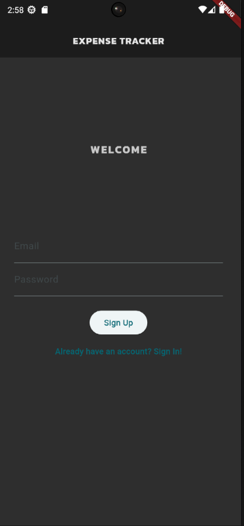
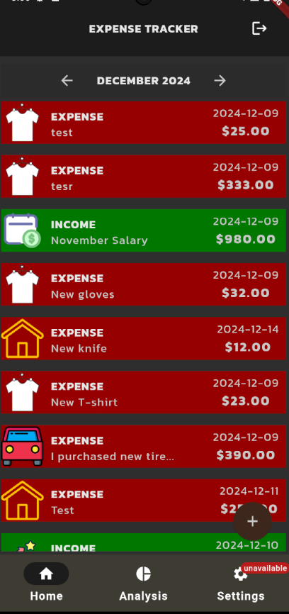
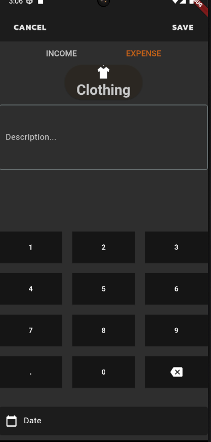
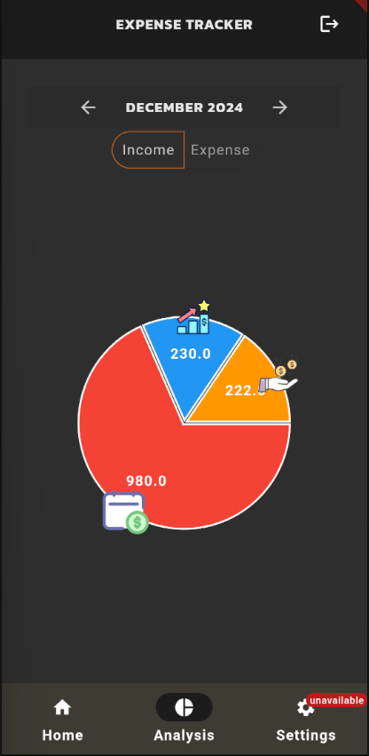

Welcome to the Expense Tracker app, a personal project developed to showcase my skills in mobile app development with Flutter. This app helps users track their income and expenses efficiently, utilizing Firebase Authentication and Firestore for secure data storage, and Riverpod for state management.

Features
Welcome Screen:
The app starts with a welcome screen that provides users the option to either sign in or sign up using Firebase Authentication.

Home Screen:
After signing in, users are directed to the home screen. On this screen:

Users can see his list of records loaded from Firebase Firestore for a selected period.
The user can change the period to see records for a different timeframe.
The AppBar contains a title and a Log Out button.
At the bottom-right of the home screen, there is a positioned button that navigates to the Create Record Screen.
Create Record Screen:
When the user taps the button on the home screen to add a new record:

The AppBar contains two buttons: Cancel and Save.
The user can switch between Income and Expense categories.
The user can select a Category based on the transaction type.
A Description field allows the user to insert details for the transaction.
At the bottom of the screen, the user can select a date for the transaction using the Date Picker.
Analysis Screen:
The second screen of the app is the Analysis Screen, where users can:

Change the period to filter the records.
Switch between Income and Expense to see their statistic.
The app displays the data visually in a Pie Chart.
Navigation:
The app uses a Navigation Bar to switch between the different screens.

Firebase Firestore:
The app uses Firebase Firestore to store records and retrieve them.

State Management with Riverpod:

StreamProvider: Manages user authentication state.
NotifierProvider: Retrieves and manages records from Firestore.
Technologies Used
Firebase Authentication: For user sign-in and sign-up.
Firebase Firestore: For storing user records and retrieving them dynamically.
Riverpod: For state management (StreamProvider and NotifierProvider).
Flutter: Framework for building the mobile app.
Pie Chart: For visualizing the user's balance in the Analysis Screen.
Date Picker: For selecting transaction dates.
TweenSequenceAnimation: For advanced UI animations.
showModalBottomSheet: For displaying the modal sheet when creating records.
## Screenshots

*Welcome Screem*

*Welcome Screem*

*Welcome Screem*

*Welcome Screem*

